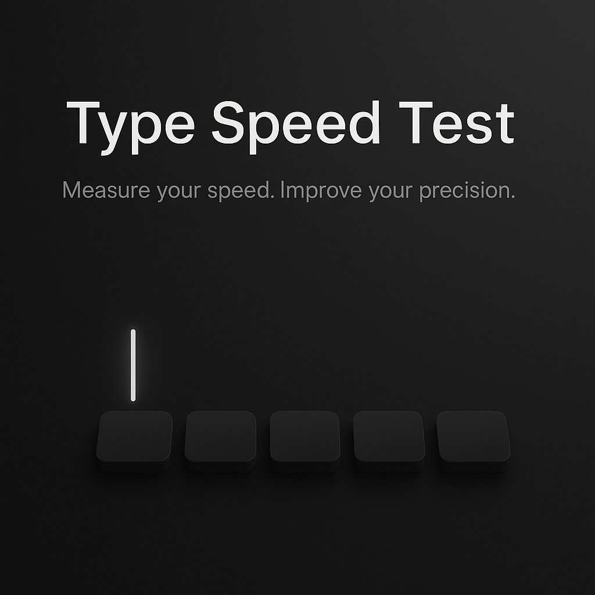

  

  
  
  

  <b>Test your typing speed anytime — with a clean, modern benchmark-style interface.</b> 
  <i>Built with React, Vite, and Tailwind CSS.</i>

---

## ⌨️ Overview

**Type Speed Test** recreates the feel of popular typing benchmarks, but in a simple and distraction-free way.
It helps you measure your **WPM**, **accuracy**, and overall typing performance through a smooth real-time test.

This version focuses on:

* Minimal UI
* Fast performance
* Easy restart flow
* Accurate typing feedback

---

## ✨ Features

| Feature                  | Description                              |
| ------------------------ | ---------------------------------------- |
| ⚡ **Instant Start**      | Test begins as soon as typing starts     |
| ⏱ **60-Second Mode**     | Consistent time-based challenge          |
| 📈 **Live WPM**          | Speed updates while typing               |
| 🎯 **Accuracy Tracking** | Calculates typing precision              |
| 🌙 **Dark UI**           | Modern, comfortable typing environment   |
| 🔄 **Restart Test**      | Quick reset for another round            |
| ⌨️ **Benchmark Feel**    | Inspired by Human Benchmark & Monkeytype |

---

## 🛠 Tech Stack

| Layer         | Tools        |
| ------------- | ------------ |
| Frontend      | React + Vite |
| Language      | TypeScript   |
| Styling       | Tailwind CSS |
| UI Components | shadcn/ui    |

---
